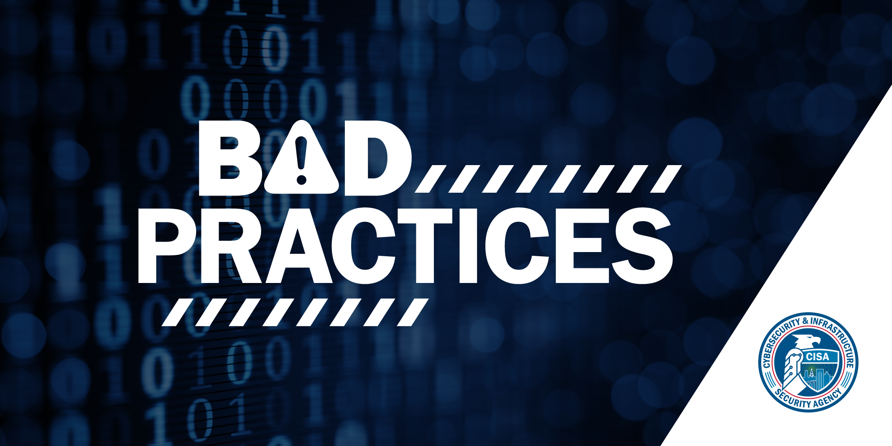

# 👋 Welcome to CISA's Bad Practices Catalog #

We’re using [GitHub
discussions](https://github.com/cisagov/bad-practices/discussions) as a place to
connect and engage in a critical conversations with other members in the
community. We hope that you will:

- Ask questions if something doesn't make sense.
- Share your thoughts on existing, and ideas for future, bad practice entries.
- Engage with us and other community members on ideas and actions to eradicate
  bad practices.
- Welcome others and maintain an open mind.

---

## Bad Practices ##

As recent incidents have demonstrated, cyber attacks against critical
infrastructure can have significant impacts on the critical functions of
government and the private sector. All organizations, and particularly those
supporting designated critical infrastructure or [national critical functions
(NCF)](https://www.cisa.gov/national-critical-functions) should implement an
effective cybersecurity program to protect against cyber threats and manage
cyber risk in a manner commensurate with the criticality of those NCFs to
national security, national economic security, and/or national public health and
safety.

CISA is developing a catalog of bad practices that are exceptionally risky,
especially in organizations supporting critical infrastructure or NCFs. The
presence of these bad practices in organizations that support critical
infrastructure or NCFs is exceptionally dangerous and increases risk to our
critical infrastructure, on which we rely for national security, economic
stability, and life, health, and safety of the public. Entries in the catalog
will be listed here as they are added.

1. Use of unsupported (or end-of-life) software in service of critical
   infrastructure and national critical functions is dangerous and significantly
   elevates risk to national security, national economic security, and national
   public health and safety. This dangerous practice is especially egregious in
   technologies accessible from the internet.

1. Use of known/fixed/default passwords and credentials in service of Critical
   Infrastructure and national critical functions is dangerous and significantly
   elevates risk to national security, national economic security, and national
   public health and safety. This dangerous practice is especially egregious in
   technologies accessible from the internet.

1. The use of single-factor authentication for remote or administrative access
   to systems supporting the operation of Critical Infrastructure and national
   critical functions (NCF) is dangerous and significantly elevates risk to
   national security, national economic security, and national public health and
   safety. This dangerous practice is especially egregious in technologies
   accessible from the internet.

While these practices are dangerous for critical infrastructure and NCFs, CISA
encourages all organizations to engage in the necessary actions and critical
conversations to address bad practices.

*Note: This list is focused and does not include every possible inadvisable
cybersecurity practice. The lack of inclusion of any particular cybersecurity
practice does not indicate that CISA endorses such a practice or deems such a
practice to present acceptable levels of risk.*

## Contributing ##

Join the [bad practices
discussion](https://github.com/cisagov/bad-practices/discussions).  We welcome
feedback about our current catalog of bad practices and want to hear your
suggestions for additions.

## License ##

This project is in the worldwide [public domain](LICENSE).

This project is in the public domain within the United States, and
copyright and related rights in the work worldwide are waived through
the [CC0 1.0 Universal public domain
dedication](https://creativecommons.org/publicdomain/zero/1.0/).

All contributions to this project will be released under the CC0
dedication. By submitting a pull request, you are agreeing to comply
with this waiver of copyright interest.
